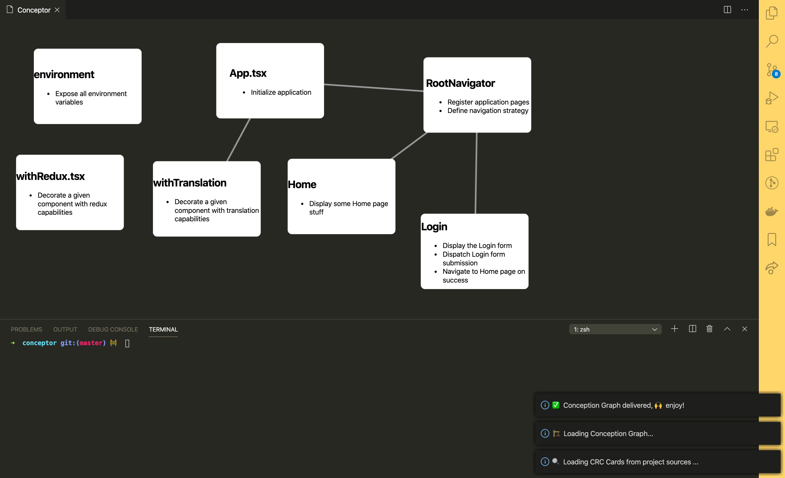

# Conceptor

Conceptor is a visualizing tool to help you apprehend technical conception in you software development process.
It implements the concept of [CRC Cards](http://agilemodeling.com/artifacts/crcModel.htm) and mainly focuses on helping you highlight the concepts of components ["responsibilities"](https://medium.com/@severinperez/writing-flexible-code-with-the-single-responsibility-principle-b71c4f3f883f) and "collaboration" between them.

## Prerequisites

Supported project languages:

- Javascript
- Typescript

## Usage

### 1. 📝 Document your components

Use [jsdoc](https://jsdoc.app/) to add the following header to your files:

```javascript
/**
 * @name MyComponent
 * @responsibility This component handles on thing
 * @responsibility This component also handles this other thing
 **/
```

Note that the `@name` tag is optional. If not provided, the component name will be infered from the filename.

### 2. ▶️ Run the "Conceptor"

- 💻 Open the Command Palette: `Shift+CMD+P`
- ⌨️ Type: `Conceptor`
- ☕️ Wait for it...
- 🎉Enjoy Technical Conception 😁



## Release Notes

### 0.0.1

Initial release of Conceptor

### 0.1.0

- Infer component name from file name if no annotation is provided
- Provide include/ignore file patterns configurability
- Provide conception graph layout configurability

---

### Issues ?

Should you encounter any issue or require some new feature, feel free to post an issue [here](https://github.com/bamlab/conceptor/issues), we'll be happy to take a look at it 😉.

**🙌 Enjoy!**
